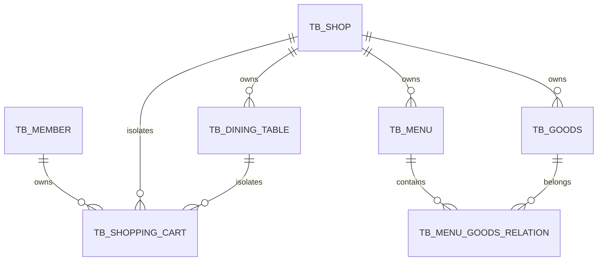

# Phase 1 数据库

## 结构文件

- 基线：`sql/mysql/siam_db.sql`
- 幂等迁移：`sql/mysql/update.sql`
- 验收时结构快照：[schema-phase1.sql](schema-phase1.sql)

## 核心关系

## Phase 1 新增结构

`tb_dining_table`：

- `id` 主键
- `shop_id`
- `table_no`
- `table_name`
- `scene_token`
- `qr_code_url`
- `status`
- `create_time`
- `update_time`

唯一约束：`(shop_id, table_no)`、`scene_token`。查询索引覆盖门店状态、场景解析。

`tb_shopping_cart` 新增 `dining_table_id`，并建立 `(member_id, shop_id, dining_table_id)` 组合索引。

`tb_order` 预留 `checkout_mode`、桌号快照、`dining_table_id`、`is_payment` 及门店状态/用户门店时间索引；Phase 1 不启用订单和支付流程。

## 幂等验证

迁移脚本通过 `information_schema` 判断字段和索引是否存在。第二次执行后结构计数不变，哨兵数据未丢失；结果见验收日志。
