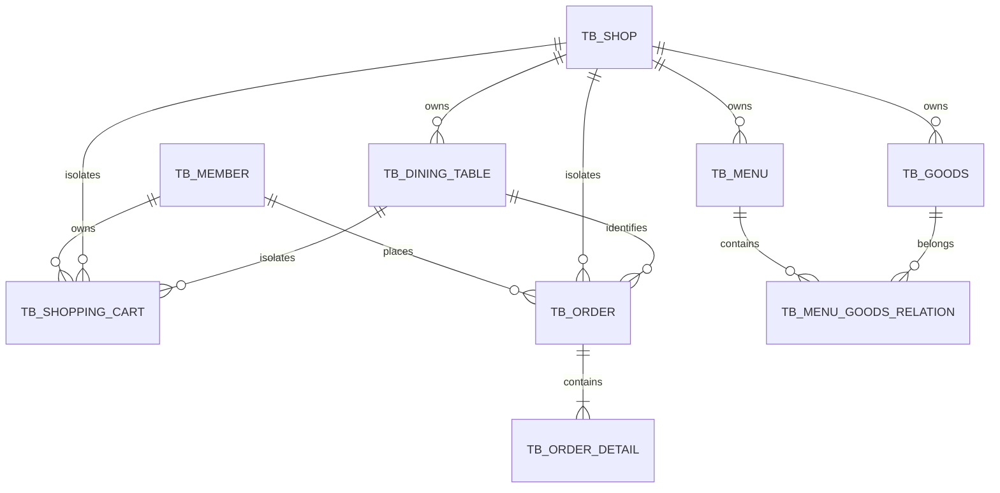

# 数据库设计

基线结构：`sql/mysql/siam_db.sql`；幂等迁移：`sql/mysql/update.sql`；Phase 1 验收快照：`docs/phase1-acceptance/schema-phase1.sql`。

`tb_dining_table` 使用 `(shop_id, table_no)` 和 `scene_token` 唯一约束。`tb_shopping_cart` 使用 `member_id + shop_id + dining_table_id` 确定唯一业务上下文。`tb_order` 保存门店、餐桌和会员快照，`order_no` 使用唯一索引。所有老板端资源通过登录 Token 获取商家和 `shop_id`，不信任前端传入的 `shopId`。

详细字段、索引及两次迁移结果见 [Phase 1 数据库说明](phase1-acceptance/DATABASE.md) 和 [迁移日志](phase1-acceptance/logs/migration-run-1.log)。
# Phase 2.2 支付表

- `tb_shop_wechat_config`：每个 `shop_id` 唯一一套微信支付 APIv3 配置；APIv3 Key、商户私钥和微信支付公钥使用服务端 AES-256-GCM 加密保存。
- `tb_wechat_payment_record`：每个订单唯一一条微信支付记录，保存服务端金额快照、预支付号和微信支付单号，用唯一索引及条件更新保证回调幂等。
